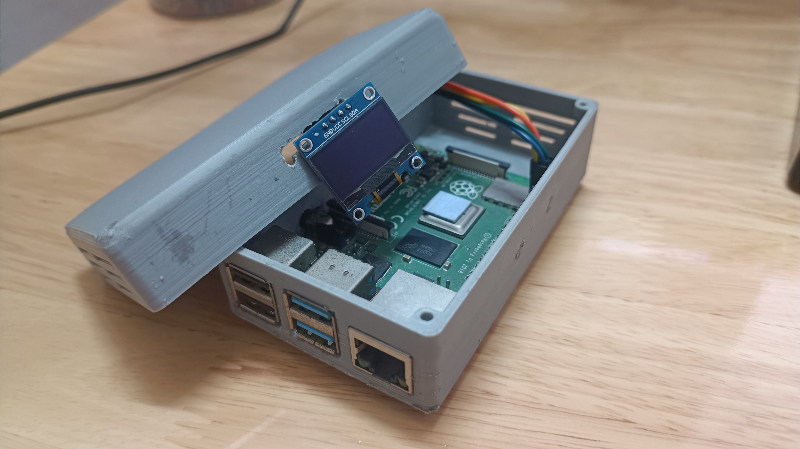
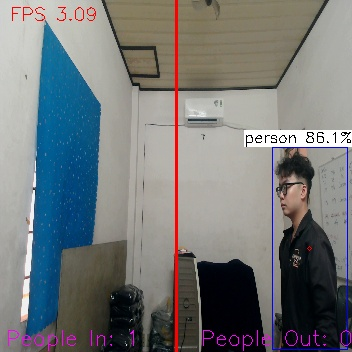

# Automatic People Counting System using Image Processing on Raspberry Pi

This repository contains the code and resources for an Automatic People Counting System implemented on the Raspberry Pi platform using Image Processing techniques.

## Overview

The Automatic People Counting System applies advanced image processing methods on the Raspberry Pi to detect and count people in real-time. It can be easily deployed in real life in a certain area as our product is portable and easy to find.

### Components

- **Raspberry Pi 4:** The central processing unit hosting the image processing algorithms and coordinating the functions of other components.

- **LCD OLED SH1106 1.3inch 128x64:** This display provides a visual interface to show the number of people walking in/out a specific area.

- **Webcam:** The webcam serves as the input device, capturing video frames for the image processing algorithms to detect and count people.



## CONNECTION

| Raspberry Pi Pin | Function     | OLED Display Pin | Webcam |
|------------------|--------------|------------------|--------|
| Pin 3 (GPIO 2)   | SDA (Serial Data) | Pin 4 (SDA) |    x   |
| Pin 5 (GPIO 3)   | SCL (Serial Clock) | Pin 3 (SCL) |   x   |
| Pin 4 (5V Power) | VCC (Power)  | Pin 2 (VCC)      |    x   |
| Pin 6 (Ground)   | GND (Ground) | Pin 1 (GND)      |    x   |
| USB Port         | Camera Display| x | USB

## How It Works

The system utilizes the power of YOLOFastestV2, optimized for Raspberry Pi with accepted frame rates, to detect people within a given frame. Once detected, a custom tracking and counting algorithm is applied.

The integration of these components on the Raspberry Pi platform enables real-time processing, making it suitable for various applications like occupancy monitoring, retail analytics, and more.



## Getting Started

To set up and run the Automatic People Counting System on your Raspberry Pi, follow these steps:

1. Clone this repository:

    ```bash
    git clone https://github.com/yourusername/automatic-people-counting.git
    ```

2. Navigate to the respective folders for OLED_Display and People Counting code.

3. Check the Raspberry Pi IP Address when it is connected to your own Wifi/Ethernet.

4. Change the IP Address in each specific code.

For OLED_Displaying\OLED.py: line 60.  
For People_Counting_cpp\src\main.cpp: line 296

5. If you modify the main.cpp, change your directory to "People_Counting_cpp\build" and run the below command to compile the main file.

6. (Optional) If you want to change the way people exitting or entering an area for counting purposes, just switch the two counting variable which you could find in the main.cpp
```bash 
make -j4
```

6. After that, run the OLED.py in OLED_Displaying folder (OLED_Displaying\OLED.py)

4. Then, change directory to "People_Counting_cpp\build" and run 
```bash 
./main
```

## REFERENCES
https://github.com/Qengineering/YoloFastestV2-ncnn-Raspberry-Pi-4  
https://github.com/MicrocontrollersAndMore/OpenCV_3_Multiple_Object_Tracking_by_Image_Subtraction_Cpp

---

**Note:** The system's effectiveness may vary based on environmental conditions and hardware specifications. Ensure proper configuration and testing for optimal performance.
